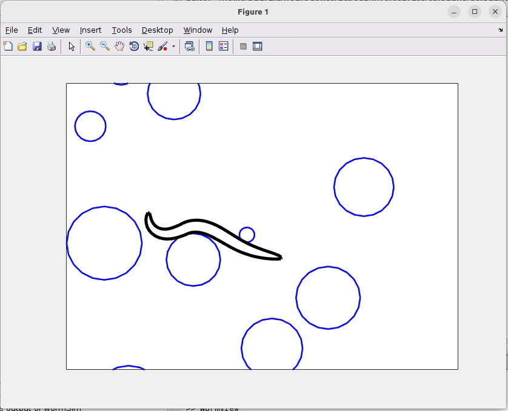
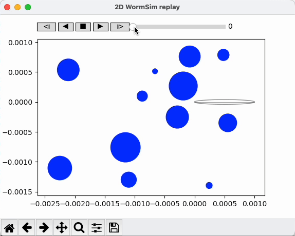

## *C. elegans* neuromechanical gait modulation

&nbsp;&nbsp;&nbsp;

A model of <i>C. elegans</i> locomotion described in Boyle, Berri and Cohen, [Gait modulation in C. elegans: an integrated neuromechanical model](http://www.frontiersin.org/Computational_Neuroscience/10.3389/fncom.2012.00010/abstract), Front. Comput. Neurosci., 2012.

For information on installing and running this code, see [here](https://github.com/OpenSourceBrain/CelegansNeuromechanicalGaitModulation/tree/master/WormSim).

